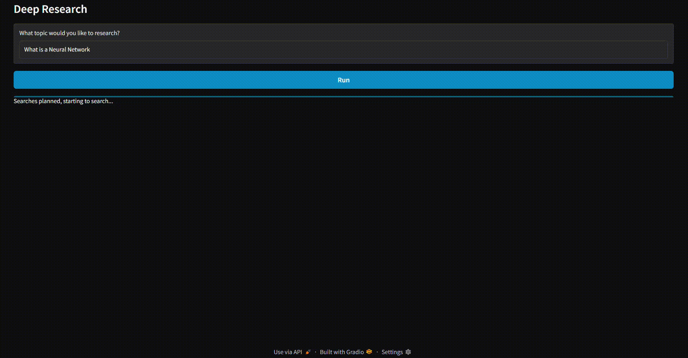

# Deep Research with OpenAI Agent SDK

A portfolio project that demonstrates a multi-agent research workflow built with the OpenAI Agent SDK and a Gradio interface.



## Overview

This project takes a user research question, plans targeted web searches, gathers concise evidence in parallel, and generates a structured markdown report.

The application is organized around four components:

- **Gradio UI** (`src/deep_research.py`): collects the query and streams progress/report output.
- **Research Manager** (`src/research_manager.py`): orchestrates the end-to-end async workflow.
- **Planner Agent** (`src/planner_agent.py`): creates a typed search plan (`WebSearchPlan`).
- **Search Agent** (`src/search_agent.py`): executes web searches and summarizes findings.
- **Writer Agent** (`src/writer_agent.py`): synthesizes results into the final report (`ReportData`).

## How It Works

The runtime pipeline is:

1. The user submits a topic in Gradio.
2. `ResearchManager.run()` opens a trace and emits status updates.
3. `plan_searches()` asks `PlannerAgent` for a list of search queries.
4. `perform_searches()` runs all searches concurrently with `asyncio.create_task(...)`.
5. Failed searches are ignored (they return `None`), while successful summaries are collected.
6. `write_report()` sends the original query and aggregated summaries to `WriterAgent`.
7. The markdown report is streamed back to the UI.

This design keeps the UX responsive while still performing multiple web lookups.

## Project Structure

```text
OpenAI Agent SDK/
├─ media/
│  └─ deep_search.gif
├─ src/
│  ├─ deep_research.py
│  ├─ research_manager.py
│  ├─ planner_agent.py
│  ├─ search_agent.py
│  └─ writer_agent.py
└─ pyproject.toml
```

## Requirements

- Python 3.12+
- OpenAI API key (set in environment variables)

## Setup

Install dependencies from `pyproject.toml`.

### Option 1: `uv` (recommended)

```bash
uv sync
```

### Option 2: `pip`

```bash
pip install -e .
```

Create a `.env` file in the project root (or export env vars directly):

```env
OPENAI_API_KEY=your_api_key_here
```

The app calls `load_dotenv(override=True)`, so local `.env` values are loaded automatically.

## Run the App

From the project root:

```bash
python src/deep_research.py
```

Gradio opens in your browser and you can start a research run from the input box.

## Why This Project Is Useful for a Portfolio

- Shows orchestration of multiple specialized AI agents.
- Demonstrates typed outputs with Pydantic models for safer pipelines.
- Uses async concurrency to improve throughput on independent web searches.
- Provides an interactive, demo-ready UI for non-technical reviewers.
- Includes trace support to inspect and debug execution flow.

