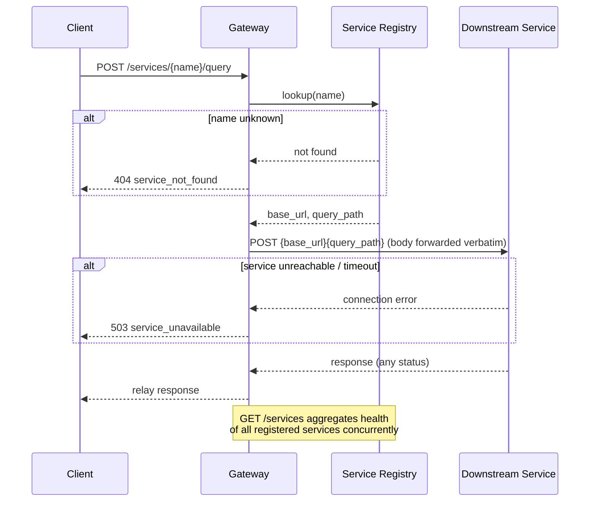

# gateway

Single entrypoint of the **[Portfolio microservices hub](../readme.md)**. A
FastAPI service that holds a **registry** of downstream microservices, aggregates
their health, and **routes queries** to them over HTTP.

It is a thin reverse proxy: it forwards each request body verbatim to the target
service and relays the response, so it stays fully decoupled from every
service's payload schema, implementing a classic API-gateway / service-registry
pattern.

## Endpoints

| Method | Path | Description |
| --- | --- | --- |
| `GET` | `/ping` | Liveness probe |
| `GET` | `/gateway/api/v1/health` | Health check |
| `GET` | `/gateway/api/v1/status` | Gateway metadata + registered services |
| `GET` | `/gateway/api/v1/services` | List services with live health |
| `POST` | `/gateway/api/v1/services/{name}/query` | Route a query to a service |

### Routing a query

```bash
# unified entrypoint -> queries a service
curl -X POST localhost:8000/gateway/api/v1/services/portfolio-assistant/query \
  -H 'content-type: application/json' \
  -d '{"question": "What technologies does Mario know?"}'
```

The body is forwarded as-is; each service documents its own schema (surfaced in
`query_example` by `GET /services`). If a service is down or unconfigured the
gateway returns `503 service_unavailable` -- it degrades gracefully.

## Request flow



## Registry

Services are declared in [`configs/files/local.yml`](src/gateway/webserver/configs/files/local.yml)
(name, description, paths, example body, default `base_url`). Each base URL is
overridable with a `*_URL` environment variable (`PORTFOLIO_ASSISTANT_URL`,
`DEEP_RESEARCH_URL`) -- used by docker-compose to point at the
in-network service hostnames. `request_timeout_seconds` (in the YAML) bounds each
downstream call.

## Run

```bash
uv sync
uv run pytest -q
uv run python -m gateway          # http://localhost:8000/ping
```

The whole hub (gateway + services) is orchestrated from the
[root `docker-compose.yml`](../docker-compose.yml).
