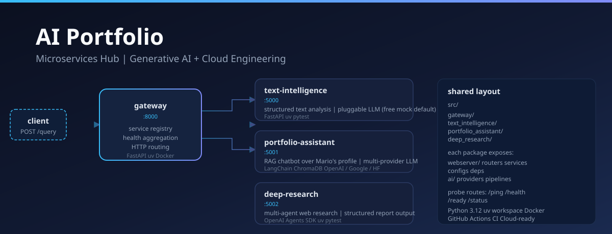
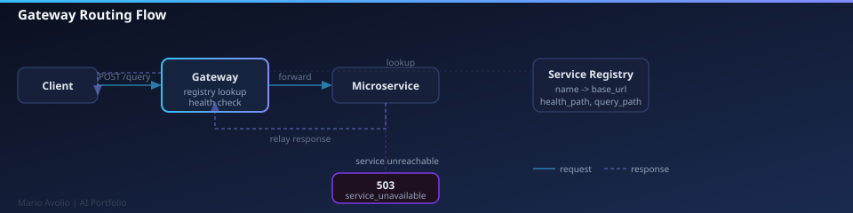
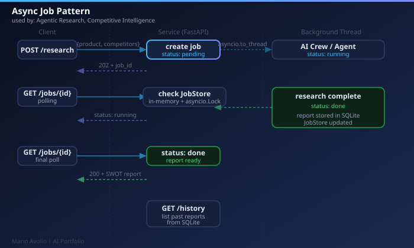
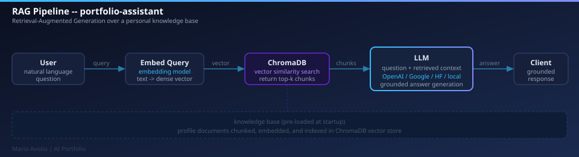

# AI Portfolio -- Microservices Hub



This repository is a **microservices hub**: a single API **gateway** fronts a set
of independent **FastAPI microservices**, each demonstrating a slice of practical
**Generative AI + Cloud** engineering. Every project lives behind one unified
entrypoint and is queried through the same route.

The architecture follows a classic **API-gateway / service-registry** pattern:
the gateway holds a registry, aggregates health, and routes queries over HTTP to
decoupled services -- each with its own environment, dependencies and container.

## Architecture

```text
                       ┌────────────────────────────┐
   client ───────────► │  gateway  (FastAPI)        │
                       │  /services                 │  registry + health
                       │  /services/{name}/query    │  routes over HTTP
                       └──────────────┬─────────────┘
                                      │
             ┌─────────────────────────┼──────────────────────────┐
             ▼                         ▼                          ▼
   portfolio-assistant         deep-research              market-sentinel
   RAG over a knowledge base   multi-agent web research   competitive intelligence
   (LangChain + Chroma)        (OpenAI Agents SDK)        (CrewAI + SQLite)
```

One way in: `POST /gateway/api/v1/services/{name}/query`. The gateway forwards
the request body verbatim to the target service and relays the response. If a
service is down or unconfigured it returns `503` -- the hub degrades gracefully.

## Services

| Service | Path prefix | Status | What it does |
| --- | --- | --- | --- |
| [`gateway`](gateway/readme.md) | `/gateway/api/v1` | [free] | Registry, health aggregation, query routing |
| [`portfolio-assistant`](services/portfolio-assistant/readme.md) | `/portfolio-assistant/api/v1` | [free] probes, [key:query] | RAG chatbot over Mario Avolio's professional profile (LangChain + Chroma) |
| [`deep-research`](services/deep-research/README.md) | `/deep-research/api/v1` | [free] probes, [key:query] | Multi-agent web research producing a structured report (OpenAI Agents SDK) |
| [`market-sentinel`](services/market-sentinel/readme.md) | `/market-sentinel/api/v1` | [key:query] | SWOT competitive intelligence (CrewAI + SerperDev + SQLite) |

`[free]` runs at **~$0** (no API key). `[key:query]` = the functional `/query` route needs
an `OPENAI_API_KEY`; without it the service returns `503` and the hub still runs.
All services share the same `src/<package>` layout.

## Repository structure

```text
Portfolio/
├─ gateway/                  # API gateway: registry + routing (FastAPI, uv)
├─ services/
│  ├─ portfolio-assistant/   # RAG chatbot + FastAPI adapter (LangChain + Chroma)
│  ├─ deep-research/         # multi-agent research + FastAPI adapter (OpenAI Agents SDK)
│  └─ market-sentinel/       # competitive intelligence (CrewAI + SQLite)
├─ docker-compose.yml        # orchestrates all services
├─ .github/workflows/ci.yml  # lint + tests per service
└─ readme.md
```

Each service is self-contained: its own `pyproject.toml`, [**uv**](https://docs.astral.sh/uv/)
lockfile, tests and Dockerfile. The `gateway` service
follows the `src/<package>` layout (app factory, operational probes,
dependency injection, domain-error envelopes).

## Getting started

```bash
# 1) Run the full stack
docker compose up --build
#    gateway: http://localhost:8000/gateway/api/v1/services

# 2) Or run gateway standalone
cd gateway && uv sync && uv run pytest -q && uv run python -m gateway
```

Heavy services (\`portfolio-assistant\`, \`deep-research\`) run locally via \`uv run python -m
portfolio_assistant\` / \`uv run python -m deep_research\` with the relevant
API key -- see each service's readme.

## LLM Providers

portfolio-assistant supports multiple LLM providers. Set `llm_provider` in
`services/portfolio-assistant/src/portfolio_assistant/webserver/configs/files/local.yml`:

| Provider | `llm_provider` | Model | API key |
| --- | --- | --- | --- |
| OpenAI | `openai` | `gpt-4.1-nano` | `OPENAI_API_KEY` |
| Google | `google` | `gemini-2.0-flash` | `GOOGLE_API_KEY` (Google AI Studio) |
| HuggingFace | `hf` | `HuggingFaceH4/zephyr-7b-beta` | `HF_TOKEN` |
| Ollama | `ollama` | `llama3.2:1b` | none (local inference) |

Pull the Ollama model: `ollama pull llama3.2:1b`

Embeddings are configured separately via `rag.embeddings`.

## Documentation

Internal documentation lives in [`docs/`](docs/):

- [Architecture](docs/ARCHITECTURE.md) -- components, topology, request flow, health model
- [Conventions](docs/CONVENTIONS.md) -- the shared `src/<package>` service layout and rules
- [Runbook](docs/RUNBOOK.md) -- how to run, test and operate every service

**Flow diagrams:**

| | |
|---|---|
| [](docs/diagrams/flow-gateway.svg) | [](docs/diagrams/flow-async-job.svg) |
| Gateway routing flow | Async job pattern |
| [](docs/diagrams/flow-rag.svg) | |
| RAG pipeline (portfolio-assistant) | |

## Roadmap

Each step is a self-contained increment (a PR) adding one demonstrable
competency:

1. **Hub foundation** [done] -- gateway (registry + routing), uv workspace, Docker, CI.
2. **Existing projects onboarded** [done] -- `portfolio-assistant` and `deep-research`
   refactored into the `src/<package>` layout as full microservices behind the
   gateway.
3. **Real LLM providers** [done] -- OpenAI, Google, and HuggingFace providers for
   \`portfolio-assistant\`.
4. **Hub console** -- a dependency-free static UI served by the gateway:
   live service registry, sync query, and async job polling through one entrypoint.
5. **Cloud storage** -- S3-compatible `StorageClient` (MinIO -> Cloudflare R2),
   persisting requests as a JSONL landing zone.
6. **Cloud deployment** -- gateway + services to Google Cloud Run (free tier);
   extend CI into CD.
7. **Agentic AI** -- a dedicated agent service with LLM tool-calling.
8. **Multi-cloud + lakehouse** -- Azure OpenAI / Azure Blob, Container Apps;
   batch job folding JSONL -> Parquet, queried with DuckDB; observability.

## Tech

Python, uv, FastAPI, Pydantic, httpx, pytest, Docker, GitHub Actions,
LangChain, ChromaDB, OpenAI Agents SDK, (planned) Gemini / OpenAI / Azure
OpenAI, MinIO / R2 / Azure Blob, Cloud Run / Azure Container Apps, DuckDB.

---

Mario Avolio - AI & Cloud Engineer
GitHub: https://github.com/MarioAvolio
LinkedIn: https://www.linkedin.com/in/mario-avolio-b6a52b1b8
