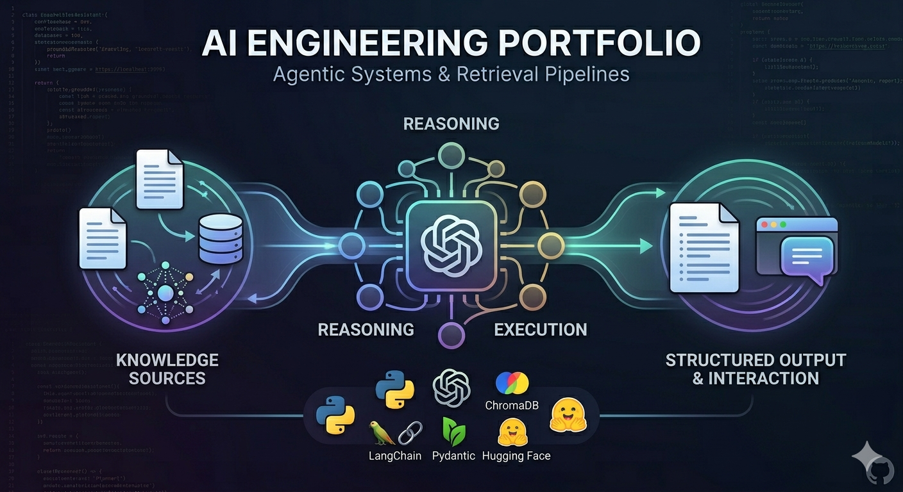

# AI Portfolio



This repository collects my practical AI engineering projects, with a focus on agentic systems, retrieval pipelines, and production-style experimentation.

The goal of this portfolio is to show how I design, implement, and document end-to-end AI workflows using Python, modern LLM tooling, and clear project structure.

## Completed Projects

### 1) InsureLLM Assistant

An end-to-end Retrieval-Augmented Generation (RAG) assistant for a fictional insurance company.

Key highlights:
- Domain-structured knowledge base (`company`, `contracts`, `employees`, `products`)
- LLM-assisted chunking with structured outputs
- Metadata-aware indexing for better traceability
- ChromaDB-based vector storage with local embeddings
- History-aware retrieval and grounded response generation

Tech focus:
- Python, LangChain, Pydantic, ChromaDB, OpenAI, Hugging Face embeddings

Project path:
- `Insurellm-Assistant/`

### 2) Deep Research with OpenAI Agent SDK

A multi-agent research application that plans searches, gathers web evidence in parallel, and writes a final structured report through a Gradio interface.

Key highlights:
- Planner, Search, and Writer agent separation
- Asynchronous orchestration for concurrent web searches
- Typed intermediate data models for reliability
- User-friendly demo UI with streamed progress
- End-to-end research-to-report pipeline

Tech focus:
- Python, OpenAI Agent SDK, Gradio, asyncio, Pydantic

Project path:
- `OpenAI Agent SDK/`

## Upcoming Projects

The portfolio is actively evolving. The following projects are planned and will be added soon:

- **CrewAI**: collaborative multi-agent workflows and task delegation patterns
- **LangGraph**: stateful agent orchestration and graph-based execution flows
- **AutoGen**: autonomous multi-agent conversations for complex problem solving
- **MCP (Model Context Protocol)**: tool interoperability and standardized context integration

## Repository Structure

```text
Portfolio/
├─ Insurellm-Assistant/
├─ OpenAI Agent SDK/
└─ README.md
```

## Notes

- More projects will be added over time as the portfolio expands.
- Each project folder includes its own implementation details and setup instructions.
