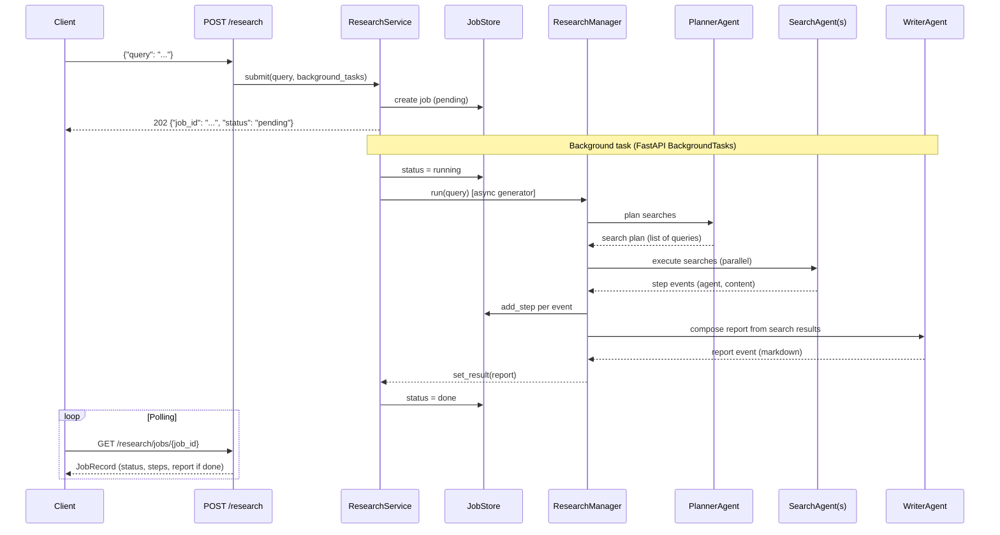

# deep-research

Multi-agent research microservice of the
**[Portfolio microservices hub](../../readme.md)**. Given a research request it
plans searches, gathers web evidence in parallel and writes a structured
markdown report, using the OpenAI Agents SDK.

Originally a standalone Gradio app, it has been refactored to the hub's
production microservice layout: the agents live under `ai/`, wrapped by a thin
`webserver` layer (app factory, probes, DI, domain-error envelope).

## Endpoints

| Method | Path | Description |
| --- | --- | --- |
| `GET` | `/ping` | Liveness probe |
| `GET` | `/deep-research/api/v1/health` | Health check |
| `GET` | `/deep-research/api/v1/status` | Service metadata |
| `POST` | `/deep-research/api/v1/query` | Run the research workflow synchronously |
| `POST` | `/deep-research/api/v1/research` | Start an async research job (202 Accepted) |
| `GET` | `/deep-research/api/v1/research/jobs/{job_id}` | Poll a job's status, steps and report |

### `POST /query`

```jsonc
// request
{ "query": "Latest trends in retrieval-augmented generation." }

// response
{ "report": "# Research report\n\n..." }
```

### `POST /research` (async)

```jsonc
// request
{ "query": "Latest trends in retrieval-augmented generation." }

// response (202 Accepted)
{ "job_id": "abc123", "status": "pending" }
```

### `GET /research/jobs/{job_id}`

```jsonc
// response (done)
{ "job_id": "abc123", "status": "done", "steps": [{"agent": "planner", "content": "...", "timestamp": "..."}], "report": "# Research report\n\n..." }
```

#### Polling sequence (curl)

```bash
# 1. Submit the research request
curl -X POST localhost:5002/deep-research/api/v1/research \
  -H 'content-type: application/json' \
  -d '{"query": "Latest trends in RAG."}'
# -> {"job_id": "abc123", "status": "pending"}

# 2. Poll until status == "done"
curl localhost:5002/deep-research/api/v1/research/jobs/abc123
# -> {"job_id": "abc123", "status": "done", "steps": [...], "report": "..."}
```
Requires an `OPENAI_API_KEY` (Agents SDK + web search). Without it -- or without

the agent dependencies installed -- the endpoint returns `503
research_unavailable`, so the hub stays demonstrable when this service is not
configured.

## Request flow



## Architecture

```text
src/deep_research/
├─ __main__.py                  # app factory (get_app) + lifespan + uvicorn
├─ ai/                          # the multi-agent core (vendored project code)
│  ├─ research_manager.py       #   orchestrates plan + search + write
│  ├─ planner_agent.py          #   decides which searches to run
│  ├─ search_agent.py           #   performs a single web search
│  └─ writer_agent.py           #   writes the final report
└─ webserver/
   ├─ __init__.py               # facade: get_configs / get_logger / Configs
   ├─ configs/configs.py        # Pydantic config
   ├─ configurations.py         # env-driven loader
   ├─ dependency/deps.py        # DI
   ├─ errors.py                 # domain errors + HTTP envelope
   ├─ models/query.py           # request/response models
   ├─ models/job.py             # job + step models for async research
   ├─ stores/job_store.py       # in-memory job store
   ├─ routers/                  # alive + health + status + query + research
   └─ services/research_service.py  # lazy-runs the agent workflow
```

The workflow is imported and run **lazily** on the first query, so the app and
its probe tests import without the agent stack.

## Run

```bash
uv sync
uv run pytest -q                 # probe tests (no key, no cost)
OPENAI_API_KEY=sk-... uv run python -m deep_research   # http://localhost:5002/ping
```
