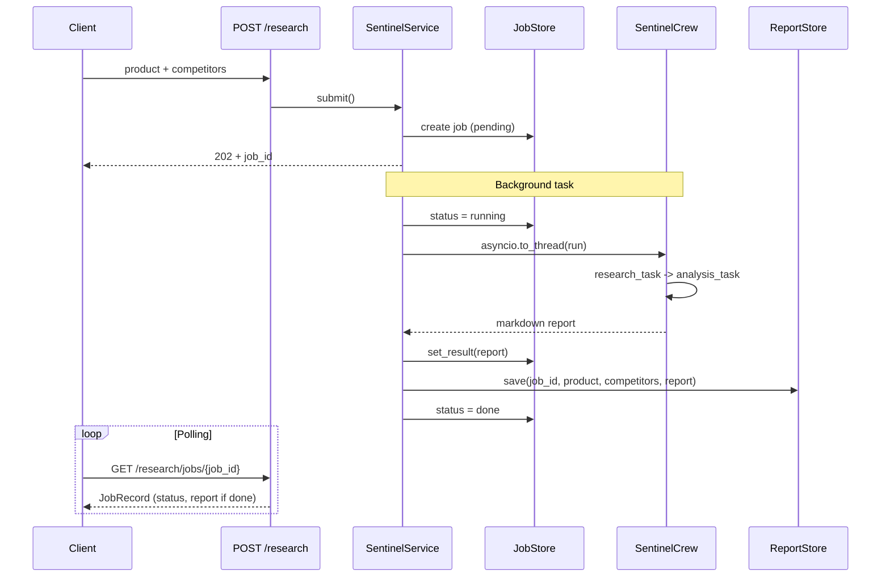

# market-sentinel

Multi-agent competitive intelligence microservice.

**Port:** 5003 | **API prefix:** `/market-sentinel/api/v1`

## Endpoints

| Method | Path | Description |
|---|---|---|
| POST | `/market-sentinel/api/v1/research` | Submit a new competitive analysis job (202 + full `JobRecord`) |
| GET | `/market-sentinel/api/v1/research/jobs/{job_id}` | Poll job status and retrieve report |
| GET | `/market-sentinel/api/v1/research/history` | List recent completed reports from SQLite |
| GET | `/market-sentinel/api/v1/health` | Service health |
| GET | `/market-sentinel/api/v1/ready` | Readiness probe |
| GET | `/market-sentinel/api/v1/status` | Service metadata (name, version, environment) |
| GET | `/ping` | Liveness probe (root, no prefix) |

## Request flow



## Env vars

| Variable | Required | Default | Description |
|---|---|---|---|
| `OPENAI_API_KEY` | Yes | — | LLM for CrewAI agents |
| `SERPER_API_KEY` | Yes | — | Web search via SerperDev |
| `ENVIRONMENT` | No | `local` | Config profile (`local` / `production`) |

## Quick start

```bash
# From repo root
cd services/market-sentinel
uv sync
export OPENAI_API_KEY=sk-...
export SERPER_API_KEY=...
uv run python -m market_sentinel
```

## Testing

```bash
# From services/market-sentinel
uv run pytest test/ -v --cov=src/ --cov-report=term-missing
```

Probe tests run without any API key.
