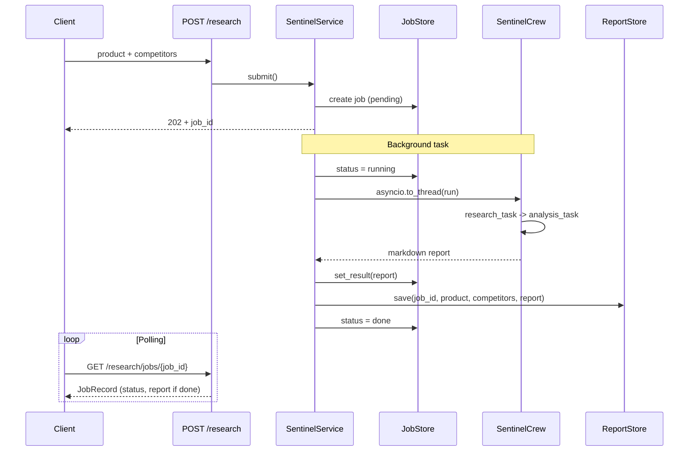

# market-sentinel

Multi-agent competitive intelligence microservice of the
**[Portfolio microservices hub](../../readme.md)**. Given a product name and a
list of competitors it searches the public web, synthesises the findings and
returns a structured SWOT report with a strategic briefing. The workflow is
orchestrated by **CrewAI** (two sequential agents) and exposed as an **async
job API**: submit, poll, retrieve.

**Port:** 5003 | **API prefix:** `/market-sentinel/api/v1`

## What it does

1. **Market Researcher** agent searches the web (SerperDev) for each entity:
   features, pricing, target market, recent news (last 6 months), strengths and
   weaknesses.
2. **Strategic Analyst** agent turns those notes into a markdown document:
   SWOT table (2x2) plus a 300-500 word briefing (opportunities, threats,
   recommendations).

The HTTP layer returns immediately with a `job_id`; the Crew runs in a
background task so long LLM + search calls do not block the event loop.

## Endpoints

| Method | Path | Description |
| --- | --- | --- |
| `GET` | `/ping` | Liveness probe (root, no prefix) |
| `GET` | `/market-sentinel/api/v1/health` | Health check |
| `GET` | `/market-sentinel/api/v1/ready` | Readiness probe |
| `GET` | `/market-sentinel/api/v1/status` | Service metadata |
| `POST` | `/market-sentinel/api/v1/research` | Submit a competitive analysis job (202) |
| `GET` | `/market-sentinel/api/v1/research/jobs/{job_id}` | Poll job status and report |
| `GET` | `/market-sentinel/api/v1/research/history` | List recent completed reports (SQLite) |

Interactive docs: `http://localhost:5003/docs`

### `POST /research`

```jsonc
// request
{
  "product": "Notion",
  "competitors": ["Obsidian", "Coda"]
}

// response (202 Accepted) — full JobRecord, report still null
{
  "job_id": "a1b2c3d4-e5f6-7890-abcd-ef1234567890",
  "product": "Notion",
  "competitors": ["Obsidian", "Coda"],
  "status": "pending",
  "report": null,
  "error": null,
  "created_at": "2026-06-14T10:30:00.123456Z",
  "updated_at": "2026-06-14T10:30:00.123456Z"
}
```

Validation rules:

- `product`: 1-200 characters, non-empty
- `competitors`: 1-5 items (empty list -> 422)

### `GET /research/jobs/{job_id}`

```jsonc
// response while running
{
  "job_id": "a1b2c3d4-e5f6-7890-abcd-ef1234567890",
  "product": "Notion",
  "competitors": ["Obsidian", "Coda"],
  "status": "running",
  "report": null,
  "error": null,
  "created_at": "...",
  "updated_at": "..."
}

// response when done
{
  "job_id": "a1b2c3d4-e5f6-7890-abcd-ef1234567890",
  "product": "Notion",
  "competitors": ["Obsidian", "Coda"],
  "status": "done",
  "report": "# SWOT Analysis\n\n| Strengths | Weaknesses |\n...",
  "error": null,
  "created_at": "...",
  "updated_at": "..."
}

// response when failed
{
  "job_id": "a1b2c3d4-e5f6-7890-abcd-ef1234567890",
  "status": "failed",
  "report": null,
  "error": "OpenAI API error: ...",
  ...
}

// unknown job_id -> 404
{
  "error_code": "job_not_found",
  "message": "Job not found.",
  "job_id": "does-not-exist"
}
```

### `GET /research/history?limit=20`

Returns metadata for completed reports stored in SQLite (newest first). The
full markdown text is **not** included — use `GET /research/jobs/{job_id}` for
that while the job is still in memory, or query the DB directly.

```jsonc
// response
[
  {
    "job_id": "a1b2c3d4-e5f6-7890-abcd-ef1234567890",
    "product": "Notion",
    "competitors": ["Obsidian", "Coda"],
    "created_at": "2026-06-14T10:35:00.123456"
  }
]
```

## Job lifecycle

| Status | Meaning |
| --- | --- |
| `pending` | Job accepted; background task not started yet |
| `running` | CrewAI crew is executing (search + analysis) |
| `done` | Report available in `report`; also persisted to SQLite |
| `failed` | Workflow raised an exception; see `error` |

Typical timeline after `POST /research`:

```text
pending  ->  running  ->  done
                         (or failed)
   ^            ^            ^
 create()   update_status   set_result() + ReportStore.save()
```

### Inside `JobStore.create()` (first step)

When you submit a job, `SentinelService.submit()` generates a UUID and calls
`JobStore.create()` before scheduling the Crew:

```python
# SentinelService.submit() (simplified)
job_id = str(uuid4())
job = await job_store.create(job_id, "Notion", ["Obsidian", "Coda"])
background_tasks.add_task(run_job, job_id, "Notion", ["Obsidian", "Coda"])
return job  # status == "pending", report == None
```

`create()` builds a `JobRecord` and stores it under the lock:

```python
job = JobRecord(
    job_id=job_id,
    product="Notion",
    competitors=["Obsidian", "Coda"],
    status="pending",
    created_at=now,
    updated_at=now,
)
async with self._lock:
    self._jobs[job_id] = job
return job
```

Nothing is analysed yet — the record is a ticket in the queue. The actual
Crew runs later in `_run_job`, inside `asyncio.to_thread()` so blocking LLM
calls do not freeze the API.

## End-to-end example (curl)

Requires `OPENAI_API_KEY` and `SERPER_API_KEY`. Analysis can take 1-3 minutes.

```bash
# 1. Submit
curl -s -X POST http://localhost:5003/market-sentinel/api/v1/research \
  -H 'content-type: application/json' \
  -d '{"product": "Notion", "competitors": ["Obsidian", "Coda"]}'
# -> {"job_id": "...", "status": "pending", "report": null, ...}

# 2. Poll until status is "done" or "failed"
JOB_ID="<paste job_id here>"
curl -s "http://localhost:5003/market-sentinel/api/v1/research/jobs/$JOB_ID"

# 3. List past reports (metadata only)
curl -s "http://localhost:5003/market-sentinel/api/v1/research/history?limit=5"
```

### Polling loop (bash)

```bash
JOB_ID="<paste job_id here>"
while true; do
  STATUS=$(curl -s "http://localhost:5003/market-sentinel/api/v1/research/jobs/$JOB_ID" \
    | python -c "import sys,json; print(json.load(sys.stdin)['status'])")
  echo "status: $STATUS"
  [ "$STATUS" = "done" ] || [ "$STATUS" = "failed" ] && break
  sleep 5
done
```

### Polling loop (Python)

```python
import time
import httpx

BASE = "http://localhost:5003/market-sentinel/api/v1"

with httpx.Client(timeout=30.0) as client:
    resp = client.post(
        f"{BASE}/research",
        json={"product": "Notion", "competitors": ["Obsidian", "Coda"]},
    )
    resp.raise_for_status()
    job_id = resp.json()["job_id"]
    print(f"submitted: {job_id}")

    while True:
        job = client.get(f"{BASE}/research/jobs/{job_id}").json()
        status = job["status"]
        print(f"status: {status}")
        if status == "done":
            print(job["report"])
            break
        if status == "failed":
            print(f"error: {job['error']}")
            break
        time.sleep(5)
```

## Request flow



## CrewAI pipeline

Two agents run **sequentially** (`Process.sequential`). Prompts live in YAML;
heavy imports (`crewai`, `crewai_tools`) are deferred inside `run()` so probe
tests import without the ML stack.

```text
research_task (Market Researcher + SerperDevTool)
    |
    v
analysis_task (Strategic Analyst, context = research_task output)
    |
    v
markdown SWOT report
```

| Agent | Tool | Output |
| --- | --- | --- |
| Market Researcher | SerperDev (Google search) | Per-entity notes: Overview, Features, Pricing, News, Strengths, Weaknesses |
| Strategic Analyst | none (LLM only) | SWOT 2x2 table + Strategic Briefing |

Config files:

- `src/market_sentinel/ai/config/agents.yaml` — roles, goals, backstories
- `src/market_sentinel/ai/config/tasks.yaml` — task descriptions and expected output

Default LLM: `gpt-4o-mini` (override in `local.yml`).

## Architecture

```text
src/market_sentinel/
|-- __main__.py                     # get_app() + lifespan + uvicorn :5003
|-- ai/
|   |-- crew.py                     # SentinelCrew (lazy CrewAI import)
|   +-- config/
|       |-- agents.yaml
|       +-- tasks.yaml
+-- webserver/
    |-- __init__.py                 # facade: get_configs / get_logger / Configs
    |-- configs/
    |   |-- configs.py              # Pydantic Configs model
    |   +-- files/local.yml         # non-secret overrides
    |-- configurations.py           # YAML loader (@lru_cache)
    |-- dependency/deps.py          # JobStore + ReportStore + SentinelService DI
    |-- errors.py                   # job_not_found, research_unavailable envelope
    |-- models/
    |   |-- job.py                  # JobRecord, JobStatus
    |   +-- query.py                # SentinelQuery (product + competitors)
    |-- stores/
    |   |-- job_store.py            # in-memory async job tracking
    |   +-- report_store.py         # SQLite persistence (SQLAlchemy + aiosqlite)
    |-- routers/                    # alive, health, ready, status, research
    +-- services/
        +-- sentinel_service.py     # submit, poll, history, _run_job
```

### Storage model

| Store | Backend | Lifetime | Purpose |
| --- | --- | --- | --- |
| `JobStore` | In-memory dict | Process only | Live status, report text, errors |
| `ReportStore` | SQLite (`market_sentinel.db`) | Survives restart | History metadata + full report text |

After a process restart, in-flight jobs are lost but completed reports remain in
SQLite. `GET /research/history` reads SQLite; `GET /research/jobs/{id}` only
works for jobs still in the current process memory.

## Configuration

Non-secret values in `src/market_sentinel/webserver/configs/files/local.yml`:

```yaml
app_name: market-sentinel
version: "0.1.0"
environment: local
api_prefix: /market-sentinel/api/v1
db_path: market_sentinel.db
openai_model: gpt-4o-mini
```

`get_configs()` is cached with `@lru_cache` — restart the process after editing
YAML.

## Env vars

| Variable | Required | Default | Description |
| --- | --- | --- | --- |
| `OPENAI_API_KEY` | Yes | — | LLM for both CrewAI agents |
| `SERPER_API_KEY` | Yes | — | Web search via SerperDev (`crewai_tools`) |
| `ENVIRONMENT` | No | `local` | Config profile label surfaced by `/status` |

Secrets stay in `.env` at repo root — never commit them, never put them in YAML.

## Quick start

```bash
# From repo root — load secrets from .env
cd services/market-sentinel
uv sync

# Linux / macOS
set -a && source ../../.env && set +a && uv run python -m market_sentinel

# Windows PowerShell
Get-Content ..\..\.env | ForEach-Object {
  if ($_ -match '^\s*([^#][^=]+)=(.*)$') {
    [Environment]::SetEnvironmentVariable($matches[1].Trim(), $matches[2].Trim(), 'Process')
  }
}
uv run python -m market_sentinel
```

Verify probes (no API key needed):

```bash
curl http://localhost:5003/ping
curl http://localhost:5003/market-sentinel/api/v1/health
curl http://localhost:5003/market-sentinel/api/v1/status
```

## Testing

```bash
# From services/market-sentinel
uv run pytest test/ -v --cov=src/ --cov-report=term-missing
```

Probe and validation tests run without `OPENAI_API_KEY` or `SERPER_API_KEY`.
Research job tests mock `SentinelService` or pre-populate `JobStore` directly.

## Error envelope

All domain errors return:

```json
{"error_code": "<code>", "message": "<human-readable>", ...}
```

| error_code | HTTP | When |
| --- | --- | --- |
| `job_not_found` | 404 | Unknown `job_id` in `JobStore` |
| `research_unavailable` | 503 | Crew cannot start (missing keys / deps) |
| `internal_error` | 500 | Unhandled failure |
